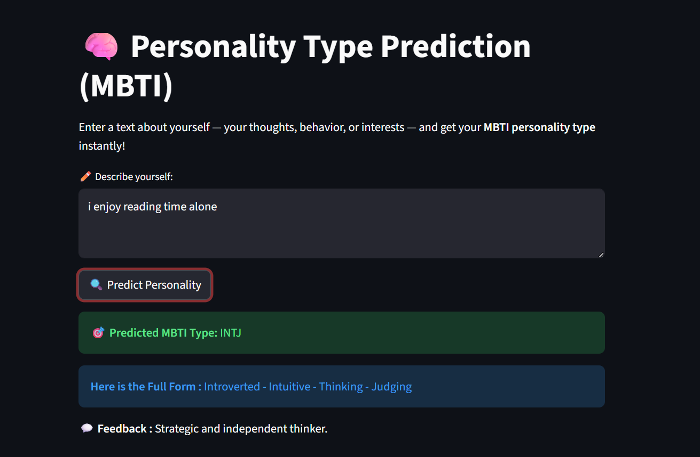

# 🧠 Personality Type Prediction using MBTI and Machine Learning

This project predicts a person's **MBTI (Myers–Briggs Type Indicator)** personality type based on text input.  It uses **TF-IDF vectorization** and **Logistic Regression** to classify text into one of the MBTI types.
Given a text input (such as a social media post, description, or message), the system analyzes linguistic patterns and predicts the four personality traits:
- I/E — Introversion / Extroversion
- N/S — Intuition / Sensing
- T/F — Thinking / Feeling
- J/P — Judging / Perceiving
The final output is a 4-letter MBTI type such as INTP, ENFP, ISTJ, ENFJ, etc.

## 🧠 Project Overview
The goal of this project is to analyze text input and classify personality characteristics. The pipeline includes:
1. **Dataset Collection**
2. **Text Preprocessing** (cleaning, tokenizing, removing stopwords)
3. **Feature Extraction using TF-IDF**
4. **Train-Test Split**
5. **Model Training using Logistic Regression**
6. **Model Evaluation 
7. **Final Personality Prediction**

## 🔧 Technologies Used
- Python
- scikit-learn
- pandas
- numpy
- matplotlib
- regex (re)

## 📎 Dataset
- Dataset Source: https://www.kaggle.com/datasnaek/mbti-type
- Size: ~8600 rows
- Columns:
   - 4 trait labels
   - Raw Posts
   - Cleaned text

## 🧪 Model Used
The system uses Logistic Regression, chosen because:
- It works well for text classification
- It is fast, interpretable, and effective on TF-IDF vectors
- It avoids overfitting better than more complex models for small datasets
- It is widely used for binary classification, matching MBTI’s binary trait system

## 📸 Screenshot

## 👤 Author
- **SHIPALI**

